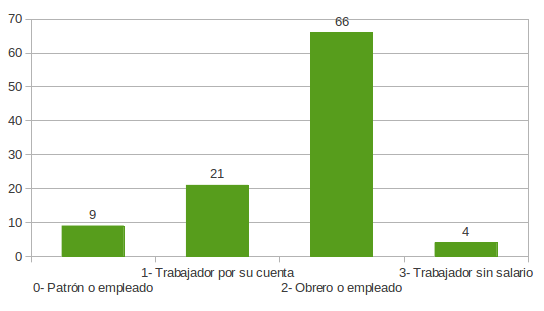

.. =============================================================================
.. ROLES
.. =============================================================================

.. role:: underline
.. role:: strike

=========================================
ACTIVIDADES INTEGRADORAS - MODULOS I Y II
=========================================

Para la realización de las siguientes actividades
integradoras, se deberá utilizar el archivo
EPH.xls. Puede acceder a la base EPH desde el
aula virtual del curso.

Actividad nro. 1
----------------

1) Con los datos de la Encuesta Permanente de Hogares, determine en cada
   una de las variables consideradas, su tipo y escala de medición, si
   corresponde.

   Si la variable es cuantitativa indique si es Discreta o Continua y si la
   variable es categórica indique su escala.

=====================  =============   ==========
**Variable**           **Tipo**        **Escala**
=====================  =============   ==========
Edad                   Cuantitativa    Discreta
Sexo                   Categórica      Nominal
Estado Civil           Categórica      Nominal
Hs. Trabajadas         Cuantitativa    Continua
Usted                  Categórica      Ordinal
Antigüedad             Cuantitativa    Discreta
Sueldo                 Cuantitativa    Continua
Sabe leer y escribir   Categórica      Ordinal
Estudios               Categórica      Ordinal
Finalizó               Categórica      Nominal
Tipo de vivienda       Categórica      Ordinal
Habitaciones           Cuantitativa    Discreta
Es Usted               Categórica      Ordinal
Total personas         Cuantitativa    Discreta
Total econ. activas    Cuantitativa    Discreta
=====================  =============   ==========

Actividad nro. 2
----------------

1) Construya tablas de frecuencias con las siguientes variables:
    - SEXO (género),
    - CIVIL (estado civil),
    - ESTUD (estudios que cursa o cursó) y
    - VIVIEN (tipo de vivienda).

    .. csv-table:: Tabla de frecuencia de Sexo
        :file: tables/act2_1_sexo_freq.csv

    .. csv-table:: Tabla de frecuencia de Estado Civil
        :file: tables/act2_1_civil_freq.csv

    .. csv-table:: Tabla de frecuencia de Estudios
        :file: tables/act2_1_estud_freq.csv

    .. csv-table:: Tabla de frecuencia de Viviendas
        :file: tables/act2_1_vivien_freq.csv

2) Responda las siguientes cuestiones:

    a) Del total de :underline:`100` individuos en la muestra,
       hay un :underline:`46` % de hombres y un :underline:`54` % de mujeres.
    b) Del total de jefes de hogar entrevistados, hay un :underline:`47` % de
       solteros, un total de :underline:`33` de casados, lo que representa
       un :underline:`80` % del total de entrevistados.
       El :underline:`3` % son unidos, los
       separados/divorciados representan el :underline:`8` % del total de
       entrevistados y finalmente  un :underline:`9` % son viudos.
    c) Con respecto al nivel de estudios que cursa o cursó, del total de
       entrevistados hay un :underline:`25` % con un nivel de estudios que no
       supera los estudios primarios, mientras que sólo hay un :underline:`16` %
       (:underline:`16` encuestados) con estudios universitarios.
    d) Con respecto al tipo de vivienda, la categoría más
       frecuente es la de :underline:`casa` que supone un total de
       :underline:`65` % del total y la categoría menos frecuente es
       la :underline:`hotel o pension` con sólo :underline:`0` encuestados que
       suponen el :underline:`0` % del total.

Actividad nro. 3
----------------

1) Realice un gráfico de barras correspondiente a la variable USTED
   (es usted).

    Situación laboral

2) Realice la tabla de frecuencias ordenada por categorías y responda
a las siguientes preguntas.

    .. csv-table:: Tabla de frecuencia de Situación Laboral
        :file: tables/act3_2_usted_freq.csv

    a) La variable ES USTED tiene :underline:`4` categorías que oscilan entre la
       categoría :underline:`1 (Patrón o empleado)` y la categoría
       :underline:`4 (Trabajador sin salario)`.

    b) La categoría más frecuente o moda es la categoría :underline:`3` que
       corresponde a la condición ocupacional de :underline:`Obrero o empleado`.
       Esta categoría representa el :underline:`66` % del total de entrevistados.

    c) La frecuencia relativa para la categoría "trabajador por su cuenta"
       es :underline:`0.21` y representa el :underline:`21` % del total de
       encuestados.

    d) El :underline:`4` % de los encuestados, es decir, :underline:`4`
       jefes de hogar son “trabajadores sin salario".

