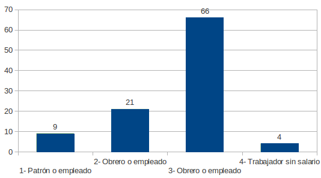

.. =============================================================================
.. ROLES AND INLINE IMAGES
.. =============================================================================

.. role:: underline
.. role:: strike

.. |hamster| image:: img/hamster.png
                :scale: 15 %

=========================================
ACTIVIDADES INTEGRADORAS - MODULOS I Y II
=========================================

.. class:: dedication

+---------------------------------------------------+------------------------+
| Para la realización de las siguientes actividades | .. image:: img/arr.png |
| integradoras, se deberá utilizar el **archivo**   |     :align: right      |
| **EPH.xls**. Puede acceder a la base EPH desde el |     :scale: 100 %      |
| aula virtual del curso.                           |                        |
+---------------------------------------------------+------------------------+

**Actividades**

|hamster| Actividad nro. 1
--------------------------

1) Con los datos de la Encuesta Permanente de Hogares, determine en cada
   una de las variables consideradas, su tipo y escala de medición, si
   corresponde.

   Si la variable es cuantitativa indique si es Discreta o Continua y si la
   variable es categórica indique su escala.

=====================  =============   ==========
Variable               Tipo            Escala
=====================  =============   ==========
Edad                   Cuantitativa    Continua [#]_
Sexo                   Categórica      Nominal
Estado Civil           Categórica      Nominal
Hs. Trabajadas         Cuantitativa    Continua
Usted                  Categórica      Ordinal
Antigüedad             Cuantitativa    Discreta
Sueldo                 Cuantitativa    Continua
Sabe leer y escribir   Categórica      Ordinal
Estudios               Categórica      Ordinal
Finalizó               Categórica      Nominal
Tipo de vivienda       Categórica      Ordinal
Habitaciones           Cuantitativa    Discreta
Es Usted               Categórica      Ordinal
Total personas         Cuantitativa    Discreta
Total econ. activas    Cuantitativa    Discreta
=====================  =============   ==========

|hamster| Actividad nro. 2
--------------------------

1) Construya tablas de frecuencias con las siguientes variables:
    - SEXO (género),
    - CIVIL (estado civil),
    - ESTUD (estudios que cursa o cursó) y
    - VIVIEN (tipo de vivienda).

.. csv-table:: Tabla de frecuencia de Sexo
    :file: tables/act2_1_sexo_freq.csv
    :header-rows: 1

.. csv-table:: Tabla de frecuencia de Estado Civil
    :file: tables/act2_1_civil_freq.csv
    :header-rows: 1

.. csv-table:: Tabla de frecuencia de Estudios
    :file: tables/act2_1_estud_freq.csv
    :header-rows: 1

.. csv-table:: Tabla de frecuencia de Viviendas
    :file: tables/act2_1_vivien_freq.csv
    :header-rows: 1

2) Responda las siguientes cuestiones:

    a) Del total de :underline:`100` individuos en la muestra,
       hay un :underline:`46` % de hombres y un :underline:`54` % de mujeres.

    b) Del total de jefes de hogar entrevistados, hay un :underline:`47` % de
       solteros, un total de :underline:`33` de casados, lo que representa
       un :underline:`80` % del total de entrevistados.
       El :underline:`3` % son unidos, los
       separados/divorciados representan el :underline:`8` % del total de
       entrevistados y finalmente  un :underline:`9` % son viudos.

    c) Con respecto al nivel de estudios que cursa o cursó, del total de
       entrevistados hay un :underline:`25` % con un nivel de estudios que no
       supera los estudios primarios, mientras que sólo hay un :underline:`16` %
       (:underline:`16` encuestados) con estudios universitarios.

    d) Con respecto al tipo de vivienda, la categoría más
       frecuente es la de :underline:`casa` que supone un total de
       :underline:`65` % del total y la categoría menos frecuente es
       la :underline:`hotel o pension` con sólo :underline:`0` encuestados que
       suponen el :underline:`0` % del total.

|hamster| Actividad nro. 3
--------------------------

1) Realice un gráfico de barras correspondiente a la variable USTED
   (es usted).

    Situación laboral

2) Realice la tabla de frecuencias ordenada por categorías y responda
a las siguientes preguntas.

    .. csv-table:: Tabla de frecuencia de Situación Laboral
        :file: tables/act3_2_usted_freq.csv
        :header-rows: 1

    a) La variable ES USTED tiene :underline:`4` categorías que oscilan entre la
       categoría :underline:`1 (Patrón o empleado)` y la categoría
       :underline:`4 (Trabajador sin salario)`.

    b) La categoría más frecuente o moda es la categoría :underline:`3` que
       corresponde a la condición ocupacional de :underline:`Obrero o empleado`.
       Esta categoría representa el :underline:`66` % del total de entrevistados.

    c) La frecuencia relativa para la categoría "trabajador por su cuenta"
       es :underline:`0.21` y representa el :underline:`21` % del total de
       encuestados.

    d) El :underline:`4` % de los encuestados, es decir, :underline:`4`
       jefes de hogar son “trabajadores sin salario".

|hamster| Actividad nro. 4
--------------------------

1) Construya una tabla de frecuencias para la variable EDAD.

    .. csv-table:: Tabla de frecuencia de Edad
        :file: tables/act4_1_edad_freq.csv
        :header-rows: 1

2) Luego responda las siguientes cuestiones:

    a) Las edades de los jefes de hogar entrevistados oscilan entre
       :underline:`18` años y :underline:`69` años.

    b)  El :underline:`57` % de los jefes de hogar tienen menos de 40 años.

    c) Los jefes de hogar con más de 30 años son :underline:`64` y
       representan el :underline:`64` % del total.

    d) ¿Podría usted construir un gráfico de barras con esta variable?
       :underline:`No`. Justifique su respuesta.
       :underline:`Por que las variables continuas deben representarse`
       :underline:`gráficamente mediante áreas o superficies pues la escala`
       :underline:`que esta medida las mismas permiten tomar valores en`
       :underline:`cualquier punto del eje horizontal` [#]_

    e) ¿Cree usted que un gráfico de frecuencias le aporta conocimiento sobre
       la variable?:underline:`Si` Justifique su respuesta.
       :underline:`debido a que se explicita de una manera sencilla cuales son`
       :underline:`edades mas comunes de los jefes de familia y permite`
       :underline:`concentrarse en otras características comunes de jefes de`
       :underline:`esa edad`.

    f) ¿Qué debería hacer con esta variable para solucionar el problema de su
       representación gráfica? :underline:`Agruparlas en intervalos de clase`.

    g) La edad más frecuente es :underline:`43 y 26` años. El promedio de edad
       de los jefes de hogar es de :underline:`40,36` años.
       ¿Es el promedio mayor a la mediana? :underline:`si`.

    h) De acuerdo a las medidas de tendencia central calculadas en el punto
       anterior, se puede decir que la distribución de la edad es
       (simétrica, asimétrica derecha/izquierda) :underline:`izquierda`.

|hamster| Actividad nro. 5
--------------------------

1) Reagrupe la variable EDAD en los siguientes intervalos y complete la
siguiente tabla de frecuencias:

.. csv-table::
    :file: tables/act5_1_edad_inter_freq.csv
    :header-rows: 1

    Histograma de Edades

2) Con los datos de la nueva variable que llamaremos EDAD 1, responda las
   siguientes preguntas:

    a) Las edades de los jefes de hogar entrevistados oscilan entre
       :underline:`10` años y :underline:`69` años.

    b) El :underline:`57` % de los jefes de hogar tienen menos de 40 años.

    c) Los jefes de hogar con más de 30 años son :underline:`65` y
       representan el :underline:`64` % del total.

|hamster| Actividad nro. 6
--------------------------

1) Con los datos originales de la variable EDAD, realice los siguientes
   gráficos: diagrama de tallo e Histograma.

    .. csv-table:: Tallo y hojas de Edad
        :file: tables/act6_1_talloyhojas.csv
        :header-rows: 1
        :widths: 20, 20, 60

2) Responda:

    a) ¿Cómo interpreta el Diagrama de tallo y hoja?
       :underline:`Es un gráfico de distribución de frecuencias donde cada`
       :underline:`tallo representan los datos agrupados por decenas. En`
       :underline:`resumen: permite obtener simultáneamente una distribución`
       :underline:`de frecuencias de la variable y su representación gráfica`

    b) Observando la distribución de frecuencias (Diagrama de Tallo y Hoja),
       ¿Qué relación encuentra entre este gráfico y el correspondiente a la
       distribución de frecuencias de la variable EDAD 1 (agrupada)?
       :underline:`Dado que en la variable EDAD 1 se utilizó intervalos`
       :underline:`coincidentes con décadas, el el diagrama de tallo y hoja`
       :underline:`al agrupar por decenas tiene la misma cantidad de`
       :underline:`intervalos con frcuencias coincidentes`.

    c) ¿Podría utilizar un gráfico Tallo y Hoja para efectuar el agrupamiento
       de una variable? :underline:`Si` ¿Por qué?
       :underline:`De hecho diagrama en si mismo es una agrupación de una`
       :underline:`variable en intervalos de clase coincidentes con decenas`.

    d) El 5 por 100 de las personas más jóvenes de la muestra no superan los
       :underline:`20` años de edad, mientras que el 5 por 100 de las personas
       de mayor edad superan los :underline:`50` años. El 50 por 100 de los
       empleados de la muestra tienen :underline:`30` años o menos.

    e) Observe el histograma y defina si la distribución de EDAD es (simétrica,
       asimétrica derecha/izquierda) :underline:`asimetrica izquierda`
       ¿Qué indicaría esta forma de la distribución?
       :underline:`Que los hombres tienden a ser jefes de familia a medida que`
       :underline:`son mas viejos`.

|hamster| Actividad nro. 7
--------------------------

Veremos ahora una tabla de frecuencias bidimensional. Recordemos que una tabla
de frecuencias bidimensional es una tabla de dos variables (doble-entrada) que
registra la cantidad de individuos que responden a dos categorías de las
variables seleccionadas. Por ejemplo, analicemos la relación entre la variable
SEXO y la variable sueldo agrupada (considerar los siguientes intervalos:
de 0 a 300; de 300 a 600; de 600 a 1000; de 1000 a 2000 y de 2000 a 2200,
cerrados por izquierda). La tabla de frecuencias bidimensional nos indicará la
cantidad de varones y mujeres que tienen ingresos de cierta categoría.

.. csv-table:: Sexo x Edad (el último intervalo también es cerrado por derecha)
    :file: tables/act_7_sexo_x_edad.csv
    :header-rows: 1

1) Responda las siguientes preguntas:

    a) De los jefes de hogar que tienen ingresos menores a 300 pesos
       :underline:`6` son varones y :underline:`16` son mujeres.

    b) La mayoría de los jefes de hogar con un sueldo de 2000 a 2200 pesos son
       (varones/mujeres) :underline:`varones`.

    c) Hay un total de :underline:`21` personas que ganan entre
       600 y 1000 pesos.

|hamster| Actividad nro. 8
--------------------------

1) Repita la tabla del ejercicio anterior, pero agregando los porcentajes en
   fila y en columna.

.. csv-table:: Sexo x Edad con porcentajes (el último intervalo también es cerrado por derecha)
    :file: tables/act_8.1_sexo_x_edad.csv
    :header-rows: 1

2) Responda las siguientes preguntas:

    a) Del total de jefes de hogar con sueldo de hasta 300 pesos, el
       :underline:`10` % son varones y el :underline:`6` % son mujeres.

    b) Entre los 46 varones hay 8 que ganan entre 600 y 1000 pesos y
       representan el :underline:`17.39` % del total de varones. [#]_

    c) Entre las 54 mujeres hay 5 que ganan entre 1000 y 2000 pesos y
       representan :underline:`9,25` % del total de mujeres. [#]_

    d) Un 10% de los jefes de hogar son mujeres y ganan entre :underline:`0`
       y :underline:`300` pesos.

    e) El :underline:`49` % de los jefes de hogar ganan entre 300 y 600 pesos,
       mientras que sólo el 9% ganan entre :underline:`1000` y
       :underline:`2000` pesos.

|hamster| Actividad nro. 9
--------------------------

Vamos a comparar las variables educaciones por sexo:
LEER (Sabe leer y escribir), ESTUD (estudios que cursa o cursó) y FINAL
(finalizó ese estudio).

1) Construya las tablas de frecuencias para estas variables y represente cada
   tabla con un gráfico de barras.

.. csv-table:: Tabla de frecuencia de variable Leer (varones)
    :file: tables/act_9.1_leer_varones_freq.csv
    :header-rows: 1

.. csv-table:: Tabla de frecuencia de variable Leer (mujeres)
    :file: tables/act_9.1_leer_mujeres_freq.csv
    :header-rows: 1

.. csv-table:: Tabla de frecuencia de variable Estudios (varones)
    :file: tables/act_9.1_estud_varones_freq.csv
    :header-rows: 1

.. csv-table:: Tabla de frecuencia de variable Estudios (mujeres)
    :file: tables/act_9.1_estud_mujeres_freq.csv
    :header-rows: 1

.. csv-table:: Tabla de frecuencia de variable Final (varones)
    :file: tables/act_9.1_final_varones_freq.csv
    :header-rows: 1

.. csv-table:: Tabla de frecuencia de variable Final (mujeres)
    :file: tables/act_9.1_final_mujeres_freq.csv
    :header-rows: 1

2) Responda las siguientes preguntas:

    a) Del total de encuestados hay :underline:`4` jefes de hogar varones que
       saben leer y escribir, lo que representa el :underline:`4` % de la
       muestra. Para el caso de las mujeres este porcentaje es del
       :underline:`6` %. ¿Considera usted importante el porcentaje de jefes de
       hogar que no saben leer y escribir?
       Comente :underline:`El 10% es un porcentaje elevado de personas que no`
       :underline:`leer ni escribir`.

    b) El :underline:`9` % de los encuestados varones tienen estudios Técnicos,
       mientras que en el caso de las mujeres este porcentaje es del
       :underline:`4` %. [#]_

    c) Hay :underline:`8` varones y :underline:`8` mujeres con estudios
       Universitarios. ¿Se podría entonces concluir que la proporción de varones
       y mujeres universitarios es la misma? (Sí/No) ¿Por qué?
       :underline:`No, dado que la proporcion total de varones es inferior al`
       :underline:`total de mujeres. Seria correcto afirmar que el número de`
       :underline:`varones universitarios es superior.`

    d) Hay más (varones/mujeres) :underline:`mujeres` que :underline:`varones`
       que finalizaron sus estudios. Sin embargo en ambos casos los porcentajes
       entre los que finalizaron y los que no finalizaron sus estudios es
       (diferente/similar) :underline:`similar`. Esto indica que hay un porcentaje
       (elevado/bajo) :underline:`bajo` de personas que no finalizan sus estudios.

    e) Tratemos ahora de obtener una conclusión general al estudio educacional
       realizado.
       :underline:`si bíen en cad análisis que se hizo parece ser que la`
       :underline:`cantidad de varones y de mujeres que tienene los mismos`
       :underline:`niveles educativos es similar; dado la proporción de mujeres`
       :underline:`relevadas (superior a los varones) se evidencia que menos`
       :underline:`mujeres llegan (en proporción) a los mismos niveles de`
       :underline:`estudio que los varones`.

|hamster| Actividad nro. 10
---------------------------

1) Probablemente sería interesante realizar una tabla de frecuencias
   bidimensional relacionando el SEXO con el ESTUDIO QUE CURSA O CURSÓ. De
   esta manera sabremos en una sola tabla cuantos varones y cuantas mujeres han
   cursado cada tipo se carrera.

.. csv-table:: Tabla binaria de frecuencia de variable Estudio de ambos sexos
    :file: tables/act_10.csv
    :header-rows: 1

¿Qué diferencia encuentra entre este tipo de análisis y el realizado
anteriormente tomando en forma separada la información de ambos sexos?
:underline:``

.. =============================================================================
.. FOOTNOTES
.. =============================================================================

.. [#] Si bien la definición que reza en el archivo
       ``Anexo_Base_de_datos.doc``

            *Columna 2: (EDAD) - Edad del jefe del hogar*
            *(medida en años cumplidos).*

       Se entiende a la variable edad como una variable **Discreta** las
       actividades no concuerdan con esta característica; por lo cual decidí
       definirla como variable **Continua**.

.. [#] *Módulo II - Organización y resumen de datos*, p.38, Curso de Postgrado
       Estadística Aplicada a la Investigación.

.. [#] Obtuve el porcentaje con respecto al total de varones calculando el
       cociente del *porcentaje de varones* que ganan entre *600 y 1000*
       respecto del *porcentaje total de varones*; y multiplicando ese
       valor por *100*.

.. [#] Obtuve el porcentaje con respecto al total de mujeres calculando el
       cociente del *porcentaje de mujeres* que ganan entre *1000 y 2000*
       respecto del *porcentaje total de mujeres*; y multiplicando ese
       valor por *100*.

.. [#] Porcentaje con respecto a cada género.

.. =============================================================================
.. HEADER AND FOOTER
.. =============================================================================

.. header::
    .. image:: img/head.png
        :scale: 100 %

    Falta grafico 9.1

.. footer::

    ###Page###
