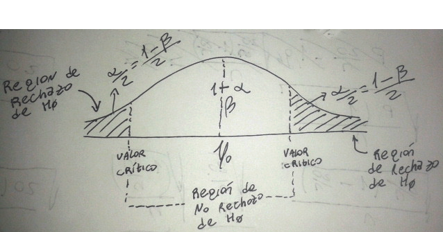

.. =============================================================================
.. ROLES AND INLINE IMAGES
.. =============================================================================

.. role:: underline
.. role:: strike

.. |hamster| image:: imgs/hamster.png
                :scale: 15 %

.. =============================================================================
.. HEADER
.. =============================================================================

.. header::
    .. image:: imgs/head.png
        :scale: 100 %

.. =============================================================================
.. ACTIVITIES
.. =============================================================================

==============================================
ACTIVIDADES INTEGRADORAS  - MÓDULOS  VIII y IX
==============================================

:Autor: Juan B Cabral
:DNI: 28818383
:Email: jbc.develop@gmail.com

En estas actividades les proponemos revisar algunos conocimientos conceptuales
y aplicar conceptos, formas de razonamiento y de cálculo a la resolución de
casos. En cada caso justifique su respuesta en forma breve, pero concisa.

**Actividades**

|hamster| Actividad nro. 1
--------------------------

Algunos conceptos y relaciones sobre estimación de parámetros:

a) ¿En qué difieren la estimación puntual de un parámetro de la estimación por
   intervalo?

    .. class:: underline

        La estimación puntual es un proceso mediante el cual se estima el parámetro
        en un punto, dando un valor específico como estimación; mientras que
        la estimación por intervalos afirma, con una determinada probabilidad, que
        el intervalo (a, b) encierra el verdadero valor de¡ parámetro.
        (pag 29, mod 8)

b) ¿Cómo está relacionado el nivel de confianza con la precisión de la
   estimación?

    .. class:: underline

        Es la probabilidad de que un intervalo contenga el parámetro estimado.
        Por lo cual si aumentamos el nivel de confianza el intervalo crecerá y
        disminuirá su precisión. En otras palabras **b-a** será mas grande.

c) ¿Cómo afecta el tamaño de la muestra a la precisión de la estimación para un
   nivel de confianza dado?

    .. class:: underline

        Al aumentar el tamaño de la muestra, disminuye la amplitud del intervalo de
        confianza, logrando así una mayor precisión en la estimación.
        (pag 36, mod 8)

d) ¿Cree usted que es posible obtener una estimación que sea idéntica al
   parámetro que se estima? ¿Cómo lo puede verificar?

    .. class:: underline

        Desde el punto de vista práctico si es posible, en el punto de vista teórico
        siempre existirá la probabilidad de que no sea exactamente igual. La única
        forma de garantizar el parámetro es a través de un censo.

|hamster| Actividad nro. 2
--------------------------

Los limites de confianza del 95% para :math:`\mu` obtenidos de una muestra dada
fueron 3,84 y 6,24 gs.

a) ¿Es correcto decir que 95 veces de cada 100 la media de la población,
   :math:`\mu`, cae dentro del intervalo comprendido entre 3,81 y 6,24 gs.? Si
   usted no está de acuerdo con esta respuesta, ¿Cuál sería a su criterio la
   interpretación correcta?

    .. class:: underline

        Casi citando pag 32 mod 8; sería mas correcto decir:

        Sobre 100 muestras aleatorias de un cierto tamaño n de una población,
        si en cada una se calcula la medía muestral :math:`\overline{x}` y, a
        partir de ellas, se construyen 100 intervalos de confianza para el
        parámetro que se desea estimar 95 contendrán al verdadero valor
        del parámetro poblacional si ese intervalo esta definido por 3,84 y
        6,24 gs.

|hamster| Actividad nro. 3
--------------------------

Se supone que ciertos tubos de acero tienen un promedio de diámetro externo de
10 pulgadas con una desviación estándar de 0,018 pulgadas.

Se desea probar:
    - H0) :math:`\mu` = 10
    - H0) :math:`\mu` :math:`\neq` 10.

Una muestra aleatoria de 36 tubos determinó: :math:`\overline{x}` = 9,94 pulgadas.

a) Construya un intervalo de confianza del 99% para p. (**NOTA:** Estimé :math:`\overline{x}` por que es lo unico que se puede)

    :math:`n=36`

    :math:`\overline{x} = 9.94`

    :math:`\sigma = 0.018`

    :math:`1- \alpha = 0.99 \to alpha = 0.01`

    :math:`\alpha / 2 = 0.005 \ to z_{\alpha/2} = -2.576`

    :math:`1 - \alpha / 2 = 0.995 \ to z_{1 - \alpha/2} = 2.576`

    :math:`P(\overline{x} - z_{1 - \alpha/2} \times \frac{\sigma}{\sqrt{n}} \leq \mu \leq \overline{x} + z_{\alpha/2} \times \frac{\sigma}{\sqrt{n}} = 1 - \alpha`

    :math:`P(9.94 - 0.0077 \leq \mu \leq 9.94 + 0.0077) = 0.99`

    :math:`P(9.9323 \leq \mu \leq 9.9477) = 0.99`

b) ¿Indica este intervalo el rechazo o no rechazo de H0 con :math:`\alpha` = 0,01?

    .. class:: underline

        Si deberia rechazarse ya que H0 esta en la zona de rechazo

|hamster| Actividad nro. 4
--------------------------

El Director de Alumbrado Público de cierta ciudad debe efectuar una gran compra
de lámparas. Además del requerimiento de que posean larga vida, el Director
quiere asegurarse de que las lámparas tengan un alto grado de uniformidad.
En principio, basándose en su experiencia, establece que la varianza no debiera
exceder de 250 horas.

Una muestra de 20 lámparas de cierta marca mostró un promedio de vida de
1.000 horas, que se considera satisfactorio, pero una varianza de 300 (horas).

a) ¿Indica este resultado que el Director debe desechar la compra a esa empresa con :math:`\alpha` = 0,05?

    :math:`\sigma^2 = 250`

    :math:`n = 20 \to n-1 = 19`

    :math:`\alpha = 0.05 \to 1-\alpha = 0.95`

    :math:`\overline{x} = 1000`

    :math:`s^2 = 300`

    :math:`\chi^2_{(n-1);(1-\alpha)} = \chi^2_{19;0.95} = 30.1`

    :math:`(n-1) \times \frac{s^2}{\sigma^2} = 19 * \frac{300}{250} = 22.8`

    .. class:: underline

        Debería aceptar ya que el resultado del test es inferior al limite impuesto

b) ¿Obtendría la misma conclusión con :math:`\alpha` = 0,10?  Comente los resultados.

    :math:`\chi^2_{(n-1);(1-\alpha)} = \chi^2_{19;0.90} = 27.2`

    .. class:: underline

        Sí, debería aceptar ya que el resultado del test es inferior al limite impuesto
        Al disminuir la confianza, el limite tambien disminuyó

c) Construya  un intervalo  de confianza  para la varianza poblacional con :math:`\alpha` = 0,05.

    .. math::

        P( \frac{(n-1) \times s^2)}{\chi^2_{(n-1);(1-\alpha/2)}}
           \leq \sigma^2 \leq
           \frac{(n-1) \times s^2)}{\chi^2_{(n-1);(\alpha/2)}} ) = 1 - \alpha

    .. math::

        P( \frac{5700}{32.9} \leq \sigma^2 \leq \frac{5700}{8.9} ) = 1 - 0.5

    .. math::

        P(173.25 \leq \sigma^2 \leq 640.45) = 0.95

|hamster| Actividad nro. 5
--------------------------

Dado que es posible realizar hipótesis estadísticas con muestras de cualquier
tamaño, ¿por qué cree usted que se prefieren las muestras grandes?

    .. class:: underline

        Ya que es la única manera que tiene el investigador de disminuir tipo 1
        y tipo 2 a la vez consiste en aumentar el tamaño de la muestra.

        (pag 61, mod 8)

|hamster| Actividad nro. 6
--------------------------

Se desea estimar la fracción de automóviles que tienen frenos defectuosos en
cierta comunidad. Se selecciona una muestra aleatoria simple de n = 100
automóviles para someterlos a inspección. De éstos, se encuentra que 20
tienen los frenos defectuosos.

a) Construya un intervalo de confianza del 95% para la fracción de automóviles
   en esa comunidad que tienen los frenos defectuosos.

    .. math::
        p = \frac{20}{100} = 0.2

    .. math::

        n = 100

    .. math::

        1 - \alpha = 0.95 \to alpha = 0.05

    .. math::

        \frac{\alpha}{2} = 0.025 \to Z_{\frac{\alpha}{2}} = -1.96

    .. math::

        1 - \frac{\alpha}{2} = 0.025 \to Z_{1 - \frac{\alpha}{2}} = 1.96

    .. math::

        P( p - Z_{1 - \frac{\alpha}{2}} \sqrt{\frac{p \times (1 - p)}{n}}
        \leq P \leq
        P( p - Z_{\frac{\alpha}{2}} \sqrt{\frac{p \times (1 - p)}{n}}
        = 1 - \alpha

    .. math::

        P(0.2 - 0.078 \leq P \leq 0.2 + 0.078) = 0.95

    .. math::

        P(0.12 \leq P \leq 0.28) = 0.95

b) Supongamos que se desea una estimación más precisa que la obtenida en a),
   ¿Qué tamaño de muestra será necesario para lograr una precisión en la
   estimación de 0,04?

    .. math::

        b - a = 0.04

    .. math::

        n = \frac{Z^2 \times p \times q}{e^2}

    .. math::

        n = \frac{1.96^2 \times 0.16}{0.0016} = 195.9  \approx 196

|hamster| Actividad nro. 7
--------------------------

a) Establezca la diferencia entre los siguientes conceptos:

- Errores Tipo I y II.
- Hipótesis nula e hipótesis alternativa.
- Región de rechazo y región de no rechazo.
- Nivel de confianza y nivel de significación.

.. class:: underline

    La hipótesis nula (:math:`H_0`) es un supuesto acerca de uno o más parámetros de la
    población que debe ser rechazado o no en base a la evidencia muestral.
    Se denomina nula en el sentido que supone que no existe diferencia real entre el verdadero
    valor del parámetro de la población de la que hemos obtenido la muestra y el valor hipotetizado.
    Si la hipótesis nula es falsa, deberá existir otra hipótesis que sea verdadera. Esta hipótesis
    recibe el nombre de hipótesis alternativa (:math:`H_1`).

    El error de Tipo I es aquel que se comete al rechazar una
    hipótesis nula cuando ella es verdadera y la probabilidad de cometerlo
    se simboliza con :math:`\alpha`, mientras que el error de Tipo II es aquel
    que se comete al no rechazar una hipótesis nula cuando en realidad es falsa.
    Su probabilidad de suceder se simboliza con :math:`\beta`.

    Se entiende por region de rechazo a todos los valores que esten fuera de los
    intervalos determinados por los valores criticos para aceptar la :math:`H_0`.
    Su sumplemento es conocido como region de no rechazo.

    El nivel de significacion de un test es la probabilidad de cometer el error
    tipo uno :math:`\alpha`; y el nivel de confianza es el complemento de la
    la significación :math:`1 - \alpha`, es una medida de la confianza con la que contamos para
    efectuar la estimación.

b) Represente gráficamente cada uno de estos conceptos para una prueba bilateral con

    H0) :math:`\mu = \mu_0` y
    H1) :math:`\mu \neq \mu_0`

|hamster| Actividad nro. 8
--------------------------

Para un nivel de significación dado, ¿cómo se afecta la potencia de un test aumentando el tamaño de la muestra?

.. class:: underline

    Dado que la potencia de un test se define como la función que establece la
    probabilidad de rechazar la hipótesis nula cuando es falsa :math:`1 - \beta`.
    La potenciá de un test es proporcional al tamaño de la muestra

|hamster| Actividad nro. 9
--------------------------

Se adopta la siguiente regla de decisión para probar la hipótesis de que una
moneda es perfecta (igual posibilidad de cara o cruz).

No rechazar la hipótesis si el número de caras en 100 tiradas se encuentra
entre 40 y 60 inclusive. En caso contrario, rechazar la hipótesis.

Plantee:

a) La hipótesis nula y la alternativa.

    - H0) :math:`40 \leq P \leq 60`
    - H1) :math:`P < 40  o P > 60`

b) ¿Cuáles son los valores críticos para esta regla de decisión en términos de
   una distribución normal estandarizada?

|hamster| Actividad nro. 10
---------------------------

Un distribuidor de comestibles desea saber si la demanda es bastante grande
como para justificar la incorporación de un nuevo producto a sus existencias.
Para tomar la decisión, planifica incorporar este producto a una muestra de los
almacenes que abastece y estimar luego el promedio de ventas mensuales. Como el
distribuidor tiene dividida la ciudad en cuatro zonas, por conveniencia
administrativa decide utilizar el muestreo aleatorio estratificado considerando
cada zona como un estrato. La cantidad de almacenes en cada estrato (zona) es:

    N1 = 24; N2 = 36; N3 = 30; N4 = 30 es decir N = 120

El distribuidor decide tomar datos de ventas mensuales en n = 20 almacenes.
Debido a que no tiene información previa respecto a las varianzas de los
estratos y dado que el costo de muestreo es el mismo en cada estrato, decide
aplicar la asignación proporcional, obteniendo los siguientes tamaños de
muestra en cada estrato:

- n1 = 20 (24/120) = 4
- n2 = 20 (36/120) = 6
- n3 = 20 (30/120) = 5
- n4 = 20 (30/120) = 5

Es decir, el nuevo producto es introducido en cuatro almacenes elegidas al azar
en la zona 1, en 6 almacenes de la zona 2, etc.

Después de un mes, el distribuidor registra las ventas cuyos resultados se
observan en la siguiente tabla:

.. csv-table::
    :header-rows: 1
    :file: static/table10.csv

a) Estime las ventas promedio del mes y establezca la precisión de la estimación.

    - :math:`\overline{x} = \frac{\sum N_{h} \times \overline{x}_{h}}{\sum N_{h}}`
    - :math:`\overline{x_{1}} = 99`
    - :math:`\overline{x_{2}} = 101.5`
    - :math:`\overline{x_{3}} = 98`
    - :math:`\overline{x_{4}} = 100`
    - :math:`\overline{x} = 99.75`
    - :math:`S_{\overline{x}}^2 = \frac{1}{N^2} \times \sum N_{h}^2 \times (1-f_{h}) \times \frac{s^2}{n_{h}}`

    - .. math::
        S_{\overline{x}}^2 = \frac{1}{120^2} \times [24^2 \times 0.96 \times \frac{78.66}{4}
                                + 36^2 \times 0.95 \times \frac{72.7}{6}
                                + 30^2 \times 0.96 \times \frac{39.5}{5}
                                + 30^2 \times 0.96 \times \frac{112.5}{5}]

    - :math:`S_{\overline{x}}^2 = 3.615 \to S_{\overline{x}} = 1.901`

b) ¿Cree usted que el procedimiento de muestreo utilizado por este distribuidor
   ha dado una estimación más precisa que si hubiese empleado un muestreo
   aleatorio simple?

   :underline:`Si dado que el muestro aleatorio simple tiene menos presición cuando`
   :underline:`los estratos son mas homogeneos  y heterogeneos entre ellos. Al cada estrato`
   :underline:`tener medias diferentes esto garantiza una mayor presicion.`

c) Analice la variable de estratificación utilizada por el distribuidor y
   sugiera una más apropiada.

    :underline:`No creo que la variable de estratificación represente correctamente`
    :underline:`la capacidad de venta de cada zonaMe parecería mas apropiado`
    :underline:`divir los estratos según el nivel socioeconomico de la ciudad`

|hamster| Actividad nro. 11
---------------------------

Un investigador desea estimar el ingreso promedio de los empleados de una
gran empresa. Se cuenta con registros de empleados listados por antigüedad y
se conoce que, en general, la empresa otorga mayores salarios a mayor antigüedad.

a) Analice la conveniencia del muestreo aleatorio simple y del muestreo estratificado para este caso.

    .. class:: underline

        Si se desea saber el ingreso con respecto a otras empresas seria mas
        conveniente utilizar el MAS, si por otro lado las diferencias de salario
        por antigüedad son muy altas, convendria estratificarlo.

b) ¿Cuál recomendaría usted y como organizada el esquema de muestreo?

    .. class:: underline

        Dado que se menciona el tema salarial en el enunciado, hago el supuesto
        que es la diferencia entre antiguedades es alta; con lo cual supongo
        el muestro estratificado.

        - **Población:** Empleados de la empresa
        - **Marco del Muestreo:** Se cuenta con registros de empleados listados por antigüedad y
          se conoce que, en general, la empresa otorga mayores salarios a mayor antigüedad.
        - Determinamos los estratos agrupando salarios similares

|hamster| Actividad nro. 12
---------------------------

La Dirección de Tránsito de cierta ciudad está interesada en establecer la
proporción de personas que circulan sin su registro de conductor. Para
verificarlo se instala un grupo de inspectores en un puesto de control de
una carretera principal y se detiene a un automovilista de cada siete.

Use los datos de la siguiente tabla para estimar la proporción de conductores
que llevan su registro.

.. csv-table::
    :header-rows: 1
    :file: static/table12.csv

El valor 1 indica que el conductor llevaba el registro y el valor 0 que no lo tenía.

a) ¿Qué tipo de muestreo se ha utilizado?

    .. class:: underline

        Sistemático

b) ¿Cree usted que se hubiese obtenido una estimación más precisa empleando el
   muestreo aleatorio simple?

    .. class:: underline

        Si comparamos esta técnica de selección de muestras con el muestreo aleatorio
        simple veremos que presenta algunas ventajas importantes. En primer lugar es más fá-
        cil sacar una muestra sistemática que una aleatorio simple y generalmente se cometen
        menos errores. Además, el muestreo sistemático parece ser más preciso que el aleatorio
        simple. (Pag 71, Mod 9)

|hamster| Actividad nro. 13
---------------------------

Un auditor se enfrenta con una larga lista de cuentas por cobrar de una
empresa. El auditor debe verificar las cantidades en base a una muestra del
10% de esas cuentas y estimar la diferencia promedio entre los valores
revisados y los asentados en el libro.

Para cada una de las siguientes situaciones establezca el procedimiento de
muestreo que usted recomendaría. En cada caso justifique su respuesta.

a) Las cuentas están ordenadas cronológicamente, teniendo las cuentas más antiguas una tendencia a tomar valores más chicos.

    .. class:: underline

        Muestreo sistemático, ya que regularmente se tomará en cuenta los diferentes valores en todo su espectro

b) Las cuentas están ordenadas aleatoriamente.

    .. class:: underline

        Muestreo aleatorio simple, dado que no estan ordenadas damos la
        misma probabilidad de ser evaluadas a cada cuenta

c) Las cuentas están agrupadas por departamentos y dentro de éstos están
   listadas en orden cronológico, tendiendo las cuentas más antiguas
   a registrar valores más pequeños.

    .. class:: underline

        Muestreo estratidficado por conveniencia organizativa (Pag 24, mod9)`

|hamster| Actividad nro. 14
---------------------------

Una muestra de 15 aves tomadas al azar en un establecimiento que cuenta con
5.000 aves y que elabora alimentos balanceados, permitió establecer un aumento
de peso promedio de 90 gs. por semana y por ave, y una desviación estándar de
10 gs. Se busca estimar el incremento de peso promedio para las 5.000 aves del
establecimiento con un intervalo de confianza del 95%.

- :math:`n=15`
- :math:`N=5000`
- :math:`1-\alpha = 0.95`
- :math:`\overline{x} = 90`
- :math:`s = 10`
- .. math::

        P(\overline{x} - t_{(n-1);(1- \frac{\alpha}{2})} \times \sqrt{s/n}
          \leq \mu \leq
          \overline{x} - t_{(n-1);(\frac{\alpha}{2})} \times \sqrt{s/n}) = 1 - \alpha
- .. math::

        P(90 - 1.75 \leq \mu \leq 90 + 1.75) = 0.95
- .. math::

        P(88.25 \leq \mu \leq 91.75) = 0.95

|hamster| Actividad nro. 15
---------------------------

Un productor de fertilizantes desea controlar el buen embolsado de sus
productos. Para ello toma una muestra aleatoria de 15 bolsas obteniendo una
desviación estándar de 0,50 kg.

¿Qué varianza se estima que tendrá la producción total con un 98% de confianza?

    .. math::

        P( \frac{(n-1) \times s^2)}{\chi^2_{(n-1);(1-\alpha/2)}}
           \leq \sigma^2 \leq
           \frac{(n-1) \times s^2)}{\chi^2_{(n-1);(\alpha/2)}} ) = 1 - \alpha

    .. math::

        P( \frac{14 \times 0.25}{29.1} \leq \sigma^2 \leq \frac{14 \times 0.25}{4.7} ) = 0.98

    .. math::

        P(0.12 \leq \sigma^2 \leq 0.74) = 0.98

|hamster| Actividad nro. 16
---------------------------

Se desea estudiar la proporción de votantes que están a favor de realizar un
convenio con una empresa internacional para la provisión de energía eléctrica.

a) En una muestra de 200 participantes en la votación se encuentra que
  114 están a favor de la firma del convenio. Estime, con un nivel de
  confianza del 95%, la verdadera proporción en toda la ciudad que está a favor
  de dicho convenio.  Interprete el resultado.

    .. math::

        p = \frac{114}{200} = 0.57

    .. math::

        n = 200

    .. math::

        1 - \alpha = 0.95 \to alpha = 0.05

    .. math::

        \frac{\alpha}{2} = 0.025 \to Z_{\frac{\alpha}{2}} = -1.96

    .. math::

        1 - \frac{\alpha}{2} = 0.025 \to Z_{1 - \frac{\alpha}{2}} = 1.96

    .. math::

        P( p - Z_{1 - \frac{\alpha}{2}} \sqrt{\frac{p \times (1 - p)}{n}}
        \leq P \leq
        P( p - Z_{\frac{\alpha}{2}} \sqrt{\frac{p \times (1 - p)}{n}}
        = 1 - \alpha

    .. math::

        P(0.57 - 0.07 \leq P \leq 0.57 + 0.07) = 0.95

    .. math::

        P(0.5 \leq P \leq 0.64) = 0.95

b) Calcule la magnitud del error de estimación.

    .. math::

        e = b - a = 0.64 - 0.5 = 0.1372

c) Si se desea que el porcentaje de votantes a favor en la muestra difiera del
   verdadero valor del parámetro poblacional en no más del 5%.
   ¿Qué tamaño debería tener la muestra?

    .. math::

        b - a = 0.05

    .. math::

        n = \frac{Z^2 \times p \times q}{e^2}

    .. math::

        n = \frac{1.96^2 \times 0.57}{0.0025} = 875.88  \approx 876

|hamster| Actividad nro. 17
---------------------------

El propietario de una pizzería sospecha que su repartidor esta utilizando la
moto del reparto para uso propio. Sabe, por experiencias anteriores, que el
recorrido diario de la moto sigue una distribución normal de media 14 km. y
desviación estándar 2 km.

Decide comprobar sus sospechas y para ello contabiliza los kilómetros
recorridos por la moto durante 10 días y obtiene: 14,5, 17, 16, 15, 12,5, 19, 14, 16,5, 15,5, 17 (km.).

¿Debe despedir al repartidor?

.. math::

    \overline{x} = 15.7

.. math::

    n = 10 \to n-1 = 9

.. math::

    \sigma = 2

Fijo nivel de confianza en 95%  :math:`1 - \alpha = 0.95`

Hipotesis:

    - H0) :math:`\mu > 14` (se despide al repartidor)
    - H1) :math:`\mu <= 14` (no se despide al repartidor)

    .. math::

        \overline{x}^* = \mu_{0} + t_{(n-1);(1-\alpha)} \times \frac{\sigma}{\sqrt{n}}

    .. math::

        \overline{x}^* = 14 + 1.833 \times \frac{2}{\sqrt{10}} = 15.16

    .. math::

        15.7 > 15.16

.. class:: underline

    Con una confianza del 95% se debe despedir al repartidor

|hamster| Actividad nro. 18
---------------------------

Un experto, basado en anteriores comicios, sostiene que si se celebran
elecciones generales en este momento, tan solo acudiría a votar el 48% de
la población. No obstante, en un sondeo electoral realizado recientemente
entre 1.500 personas, 800 tienen intención de votar. ¿Supone esto, con un
nivel de confianza del 99%, que el experto se equivoca y la intención de
voto es mayor?

- H0) P = 48
- H1) P :math:`\neq` 48

- :math:`P_{0} = 0.48`
- :math:`p=\frac{800}{1500}=0.54`
- :math:`n=1500`
- :math:`1-\alpha = 0.99`
- :math:`p_{1}^* = 0.48 + 1.645 \times 0.013 = 0.45`
- :math:`p_{2}^* = 0.48 - 1.645 \times 0.013 = 0.5`
- :math:`< p_{1}^* < p < p_{2}^*`

.. class:: underline

    El experto no se equivoca.

|hamster| Actividad nro. 19
---------------------------

En los últimos tiempos,  las ventas medias  en  un comercio  rondaban los
$1.200 diarios. Sin embargo, hace unos meses se abrió un centro comercial
cerca del mismo. El establecimiento defiende que las ventas medias se mantienen,
o incluso, han aumentado, pero que no han disminuido. Para contrastar
estadísticamente este supuesto se ha seleccionado una muestra de las ventas
diarias realizadas después de la apertura del centro comercial.

a) Establecer la hipótesis nula y alternativa.

.. class:: underline

    - H0) :math:`mu >= 1200`
    - H1) :math:`mu < 1200`

a) ¿Qué nombre recibe la probabilidad de que el establecimiento concluya
   erróneamente que las ventas medias han disminuido? Explique cómo se
   denomina y en que consiste el otro error posible.

    .. class:: underline

        Es el herror tipo 1, se representa con :math:`\alpha` o nivel de
        significación del test. El otro error consiste en no concluir que la
        media disminuyó cuando si lo hizo (:math:`\beta`)

c) El establecimiento ha encargado el estudio a un especialista y en su
   informe afirma textualmente que "el valor obtenido al realizar el contraste
   es significativo", pero el establecimiento no entiende el significado de la
   frase. ¿Significa que el establecimiento debe concluir que sus ventas
   disminuyeron, o es lo contrario?

    .. class:: underline

        Significa que no hay que rechazar H0

|hamster| Actividad nro. 20
---------------------------

Según la ley electoral de cierto país, para obtener representación
parlamentaria un partido político ha de conseguir, en las elecciones
correspondientes, al menos el 5% de los votos. Antes de efectivizarse tales
elecciones, una encuesta realizada sobre 1.000 ciudadanos elegidos al azar
revela que 36 de ellos votaran al partido P.

¿Puede estimarse, con un nivel de significación del 5%, que P obtendrá
representación parlamentaria?

- H0) :math:`P \geq 0.05`
- H1) :math:`P < 0.05`

- :math:`P_{0} = 0.05`
- :math:`n=1000`
- :math:`p=0.036`
- :math:`\alpha = 0.05`
- :math:`p^* = 0.05 - 1.645 \times \frac{\sqrt{0.05 \times (1-0.05)}}{\sqrt{1000}} = 0.038`
- :math:`p < p^*`

.. class:: underline

    P no obtendra representación parlamentaria

|hamster| Actividad nro. 21
---------------------------

Una biblioteca pública está organizada en 5 secciones, y el número de libros
de cada sección viene dado por la tabla:

.. csv-table::
    :header-rows: 1
    :file: static/table21.csv

a) Se toma el mismo número de libros de cada sección.

- :math:`N = 4000`
- :math:`n=N \times 0.05 = 200`
- :math:`n_{i} = \frac{200}{5} = 40`

b) Se toma un número de libros proporcional al tamaño de la sección.

- :math:`n_{i} = n \times \frac{N_{i}}{N}`
- :math:`n_{1} = 25`
- :math:`n_{2} = 43`
- :math:`n_{3} = 60`
- :math:`n_{4} = 35`
- :math:`n_{5} = 37`

.. =============================================================================
.. FOOTER
.. =============================================================================

.. footer::

    Los fuentes y cálculo de tablas se encuentran en:
    http://goo.gl/A1Tq4 - ###Page###
