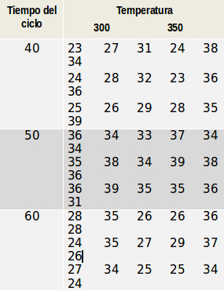
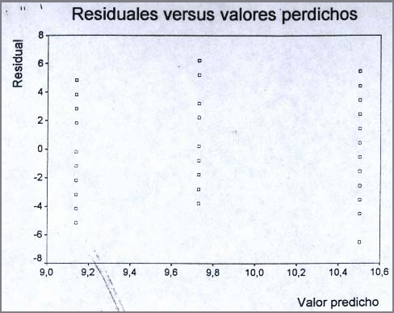

.. =============================================================================
.. ROLES AND INLINE IMAGES
.. =============================================================================

.. role:: underline
.. role:: strike

.. =============================================================================
.. HEADER
.. =============================================================================

.. header::
    .. image:: imgs/head.png
        :scale: 100 %

.. =============================================================================
.. ACTIVITIES
.. =============================================================================

================================================
ACTIVIDADES INTEGRADORAS  - MÓDULOS  X, XI y XII
================================================

:Autor: Juan B Cabral
:DNI: 28818383
:Email: jbc.develop@gmail.com

**NOTA:** Todos los calculos estan realizados con PSPP
(https://www.gnu.org/software/pspp/) la alternativa libre SPSS. El proyecto
esta apadrinado por la FSF (http://www.fsf.org/) los mismos que transformaron
el desconocido Lenguaje S en el famoso Lenguaje R.

|hamster| Actividad nro. 1
--------------------------

a. Describa situaciones donde es conveniente utilizar la metodología conocida
   como test de comparación de medias en dos muestras apareadas.

   .. class:: underline

        El objetivo del apareamiento consiste en hacer más precisa la
        comparación entre los tratamientos, teniendo en cuenta que los miembros
        del par sean lo más parecido posible y que la única diferencia que se
        encuentre en las mediciones efectuadas sobre ellos se deba
        exclusivamente al tratamiento en estudio.

b. ¿Cuáles son los supuestos que se deben establecer para aplicar un test t
   de comparación de medias en el caso de muestras independientes y muestras
   dependientes?

   .. class:: underline

        **Muestras independientes**

        1. Los errores :math:`e_{i}` se distribuyen normalmente con media 0
           y varianza :math:`{\sigma^2}_{e}`
        2. Las variables :math:`t_{j}` y :math:`e_{i}` deben ser variables
           no correlacionadas.
        3. Igualdad de varianzas para los dos grupos en estudio.

        **Muestras dependientes o apareadas**

        1. Los errores ei se distribuyen normalmente con media 0 y varianza
           :math:`{\sigma^2}_{\theta}`
        2. Las variables :math:`t_{j}` y :math:`e_{i}` deben ser variables
           no correlacionadas.

c. ¿Cuándo se deben comparar más de dos medias?, ¿por qué es conveniente
   utilizar la metodología conocida como análisis de la varianza y no
   realizar comparaciones de a pares de medias por medio de tests t?

   .. class:: underline

        Cuando el investigador desea comparar varias poblaciones,
        la primera idea que puede surgir es la de efectuar todas las
        comparaciones  posibles considerando las medias de a pares.
        Es decir, si compara, por ejemplo, 5 marcas de herbicida, digamos A,
        B, C,  D y E, podría efectuar las comparaciones de la siguiente manera:

        :math:`\mu_{A} - \mu_{B}, \mu_{A} - \mu_{C} , \mu_{A} - \mu_{D} , \mu_{B} - \mu_{C} , \mu_{B} - \mu_{D}` , etc.

        Luego, si el investigador cuenta con 5 muestras, deberá realizar 10
        test o tantos como :math:`{C^2}_{5} = 10`.

        Pero, aunque el investigador se tome el trabajo de realizar 10 test de
        hipótesis no podría generalizar simultáneamente sus resultados a las
        5 poblaciones de las cuales se extrajeron las muestras.

        Puede demostrarse que este tedioso procedimiento conduce a conclusiones
        erróneas.

d. ¿Por qué en el análisis de la varianza se utiliza un test F de comparación
   de varianzas cuando la hipótesis a probar está referida a la igualdad de
   medias poblacionales?

   .. class:: underline

        Devido a que la característica, tal vez más importante, del
        análisis de la varianza es que mediante este procedimiento
        "inferimos" la igualdad de medias a través de la igualdad de varianzas

e. ¿Qué diferencias presentan los Modelos I y II del análisis de la varianza?

   .. class:: underline

        Cuando el ANOVA considera fectos fijados por el investigador, el
        análisis se denomina ANOVA Modelo I.

        Por otro lado el ANOVA Modelo II en el que los efectos añadidos
        para cada grupo no son tratamientos fijados deliberadamente por el
        investigador sino efectos aleatorios.

f. En un modelo de análisis de la varianza, ¿cuál es la variable dependiente y
   cuál la variable independiente?

   .. class:: underline

        - :math:`t_{j}` es la variable dependiente.
        - :math:`e_{ij}` es la variable independiente.

g. ¿Cuáles son los supuestos a considerar en un Modelo I de análisis de la
   varianza y en un Modelo II?

   .. class:: underline

        **Modelo I**

        1. :math:`\mu` es constante para todos los tratamientos y todas las
           mediciones. La componente :math:`\mu` en el Modelo I es una
           componente desconocida.
        2. :math:`t_{j}` es constante para todas las mediciones dentro de un
           nivel de tratamiento pero puede diferir para otros niveles de
           tratamiento.
        3. :math:`e_{ij}` es una variable aleatoria distribuida normal e
           independientemente con media 0 y varianza constante
           :math:`\sigma^2` para todo j.

        **Modelo II**

        Los supuestos del modelo estadístico son los mismos que se han
        explicado en el caso de Modelo I. La única distinción es que se ha
        agregado ahora el supuesto de que la variable aleatoria se
        distribuye normalmente con media 0 y varianza :math:`{\sigma^2}_{a}`

|hamster| Actividad nro. 2
--------------------------

Un grupo de 4 pares de hermanos gemelos se los dividió en dos grupos. A uno
de los hermanos se les enseñó una técnica nueva para resolver ciertos
problemas matemáticos y al otro grupo se les aplicó la técnica estándar que
se venía utilizando. Los resultados en un examen realizado después de cierto
tiempo de aprendizaje fueron los siguientes:

 .. csv-table::
     :header-rows: 1

    Técnica estándar, Técnica nueva
    63, 62
    75, 80
    60,71
    85, 92

¿Qué puede decir acerca de los resultados obtenidos en cada uno de los grupos
considerados?

    Salida de PSPP

.. class:: underline

    Calculando T'=14 y T''=22 se rechaza la hipotesis nula  con lo cual
    concluimos que la técnica nueva genera una diferencia en el rendimiento
    a la técnica estandar.

|hamster| Actividad nro. 3
--------------------------

Los siguientes datos representan los tiempos que demoran cajas de velocidad
desde la línea de producción hasta el almacenamiento en lugares previamente
especificados. Se rastrean muestras de 5 embarques por día y se anota el
tiempo que tardan en recorrer este ciclo. Las muestras se seleccionan a
ciertas horas elegidas al azar y se registra el tiempo en minutos.
El objetivo consiste en estudiar la variabilidad del proceso de
almacenamiento. Los datos registrados durante 10 días fueron los siguientes:

.. csv-table:: Datos
    :header-rows: 1

    Día,Hora 1,Hora 2,Hora 3,Hora 4,Hora 5
    1,27,43,49,32,36
    2,34,29,34,31,41
    3,36,32,48,35,33
    4,31,41,51,51,34
    5,43,35,30,32,31
    6,28,42,35,40,37
    7,38,37,41,34,44
    8,28,44,44,34,50
    9,44,36,38,44,24
    10,30,43,37,29,21

a) ¿Qué conclusiones puede obtener de estos registros?
b) Explique detalladamente la metodología que utiliza y
   justifique su utilización.

|hamster| Actividad nro. 4
--------------------------

Un estudio de comprensión de lectura en niños tuvo como objetivo la
comparación de 3 métodos de enseñanza. Como es común en este tipo de estudio,
varias variables pretest fueron medidas antes de que se de alguna instrucción.
El propósito de uno de los pretest fue ver si los tres grupos de niños eran
similares en cuanto a sus habilidades de comprensión. Se usaron tres métodos
llamados basal, DRTA y estrategias. A cada método que mide la habilidad de
comprensión se asignaron al azar 22 niños.

Los puntajes obtenidos fueron los siguientes:

.. csv-table:: Datos
    :header-rows: 1

    Basal,DRTA,Estrategias
    4,7,11
    6,7,7
    9,12,4
    12,10,7
    16,16,7
    15,15,6
    14,9,11
    12,8,14
    12,13,13
    8,12,9
    13,7,12
    9,6,13
    12,8,4
    12,9,13
    12,9,6
    10,8,12
    8,9,6
    12,13,11
    11,10,14
    8,8,8
    7,8,5
    9,10,8

Analice las salidas de computación que se dan al final de las actividades y
efectúe todos los comentarios posibles utilizando todos los conceptos
aprendidos en el estudio del análisis de la varianza.

.. class:: underline

    El primer gráfico muestra por la variación entre grupos, representados por
    las medias de cada grupo juntas en el mismo gráfico.
    Se observa poca variación entre los grupos concentrándose entre los
    valores ~9.2 y ~10.5

    El segundo gráfico muestra la variabilid en cada grupo. Siendo la
    distribución más variable la de estrategias. Tanto Basal como DRTA tienen
    una variación parecida pero DRTA es marcadamente asimétrica postiva.

    El tercer gráfico demuestra que se cumple el supuesto de normalidad de
    errores. Ya que los residuales se ubican aprox a 45°.

    El último gráfico demuestra que se cumple el supuesto de independencia de
    errores. Ya que los valores no presentan un patrón en distribución.

|hamster| Actividad nro. 5
--------------------------

Los siguientes datos se refieren a una información ampliada del estudio de
métodos de lectura considerado en la actividad anterior. A los alumnos de cada
grupo se les tomaron 5 pretest cuyos puntajes se dan a continuación.

- B: Basal
- D: DRTA
- E: Estrategias

.. csv-table:: Datos
    :header-rows: 1

    Grupo,Pretest 1,Pretest 2,Pretest 3,Pretest 4,Pretest 5
    B,4,3,5,4,1
    B,6,5,9,5,1
    B,9,4,5,3,3
    B,12,6,8,5,6
    B,16,5,10,9,6
    B,15,13,9,8,5
    B,14,8,12,5,5
    B,12,7,5,5,2
    B,12,3,8,7,3
    B,8,8,7,7,9
    B,13,7,12,4,2
    B,9,2,4,4,5
    B,12,5,4,6,9
    B,12,2,8,8,4
    B,12,2,6,4,6
    B,10,10,9,10,9
    B,8,5,3,3,10
    B,12,5,5,5,5
    B,11,3,4,5,6
    B,8,4,2,3,10
    B,7,3,5,4,4
    B,9,6,7,8,2
    D,7,2,7,6,1
    D,7,6,5,6,10
    D,12,4,13,3,8
    D,10,1,5,7,10
    D,16,8,14,7,2
    D,15,7,14,6,8
    D,9,6,10,9,9
    D,8,7,13,5,3
    D,13,7,12,7,8
    D,12,8,11,6,3
    D,7,6,8,5,5
    D,6,2,7,0,5
    D,8,4,10,6,7
    D,9,6,8,6,3
    D,9,4,8,7,7
    D,8,4,10,11,10
    D,9,5,12,6,4
    D,13,6,10,6,1
    D,10,2,11,6,9
    D,8,6,7,8,7
    D,8,5,8,8,9
    D,10,6,12,6,9
    E,11,7,11,12,3
    E,7,6,4,8,7
    E,4,6,4,10,1
    E,7,2,4,4,9
    E,7,6,3,9,3
    E,6,5,8,5,5
    E,11,5,12,8,10
    E,14,6,14,12,8
    E,13,6,12,11,9
    E,9,5,7,11,2
    E,12,3,5,10,8
    E,13,9,9,9,2
    E,4,6,1,10,4
    E,13,8,13,1,8
    E,6,4,7,9,1
    E,12,3,5,13,3
    E,6,6,7,9,4
    E,11,4,11,7,8

a) Compare los puntajes promedios del pretest 1 y del pretest 2 para los
   alumnos considerados en el grupo basal.

   .. figure:: figs/act5a.png
       :align: center
       :scale: 100 %

       PSPP Output

b) Compare los puntajes promedios del pretest 2 y del pretest 3 para los
   alumnos considerados en el grupo DRTA.

   .. figure:: figs/act5b.png
       :align: center
       :scale: 100 %

       PSPP Output

c) Compare los puntajes promedios del pretest 3 y del pretest 5 para el grupo
   estrategias.

   .. figure:: figs/act5c.png
       :align: center
       :scale: 100 %

       PSPP Output

d) Compare los puntajes promedios del pretest 2 y del pretest 4 para el grupo
   basal.

   .. figure:: figs/act5d.png
       :align: center
       :scale: 100 %

       PSPP Output

|hamster| Actividad nro. 6 (OPTATIVA)
-------------------------------------

Un organismo dedicado a la actividad forestal desea determinar el efecto que
producen tres métodos de preparación del terreno sobre el crecimiento de pinos
en el primer año.

Para llevar a cabo la experiencia se seleccionaron 4 localidades y en cada una
de ellas se tomó un terreno al que se dividió en tres parcelas. Como se
esperaba que la fertilidad del suelo fuese más homogénea dentro de cada
localidad que entre las localidades, se utilizó un diseño en bloques
aleatorizados tomando las distintas localidades como bloques.

Los métodos de preparación del terreno fueron:

- **Método A:** ninguna preparación
- **Método B:** preparación ligera
- **Método C:** preparación fuerte

Las preparaciones del terreno fueron aplicadas al azar a las parcelas dentro
de cada localidad. En cada parcela se sembró la misma cantidad de árboles y
se observó su crecimiento promedio durante el primer año.

Los resultados obtenidos fueron:

.. csv-table:: Datos
    :header-rows: 1

    Preparación del terreno,Localidad 1,Localidad 2,Localidad 3,Localidad 4
    A,11,13,16,10
    B,15,17,20,12
    C,10,15,13,10

a) Proporcionan los datos suficiente evidencia que indique que hay diferencias
   entre los crecimientos medios correspondientes a las tres preparaciones del
   terreno?
b) Obtenga todas las conclusiones posibles del estudio.

|hamster| Actividad nro. 7 (OPTATIVA)
-------------------------------------

El Departamento de Control de Calidad de una fábrica dedicada a la confección
de camisas de hombres desea estudiar el efecto de dos factores sobre el teñido
de camisas de fibra sintética.

Los factores en estudio fueron:

- **Temperatura**: 300 "C y 350 "C
- **Tiempo del ciclo**: 40, 50 y 60 minutos

En cada combinación de los factores se analizaron 9 muestras de tejido y se
evaluó la calidad del teñido, asignando un índice de acuerdo a la comparación
con una calidad de teñido estándar.

Los resultados obtenidos fueron:

Efectúe un análisis conveniente de los datos y obtenga todas las conclusiones
posibles.

|hamster| Actividad nro. 8
--------------------------

Un investigador en biología está estudiando la evolución de la altura de
plantas sometidas a una fertilización en particular. Efectuando un experimento
en invernadero, siembra semillas de la planta en estudio en 9 macetas
previamente acondicionadas. El investigador efectúa mediciones de la altura de
cada planta (en cm.) a los 10, 15 y 20 días después de la germinación.

Los resultados obtenidos fueron:

.. csv-table:: DATOS
    :header-rows: 1

    Planta Nro.,10 días,15 días,20 días
    1,"3,2","3,7","4,2"
    2,"3,4","3,9","4,4"
    3,3,"3,3","3,6"
    4,"3,1","3,5",4
    5,"3,5","3,9","4,3"
    6,"3,3","3,7","4,1"
    7,"3,2","3,3","3,6"
    8,3,"3,1","3,5"
    9,"3,6",4,"4,4"

Aplique una metodología de análisis de la varianza conveniente para determinar
si existen diferencias significativas entre los promedios de altura de plantas
en los diferentes días considerados por el investigador.

.. ============================================================================
.. ANEXOS
.. ============================================================================

Anexo 1
-------

.. ============================================================================
.. FOOTER
.. ============================================================================

.. footer::

    Los fuentes y cálculo de tablas se encuentran en:
    http://goo.gl/A1Tq4 - ###Page###
