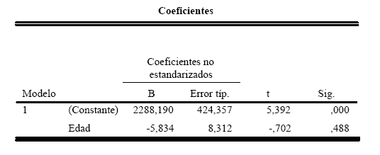

.. =============================================================================
.. ROLES AND INLINE IMAGES
.. =============================================================================

.. role:: underline
.. role:: strike

.. |hamster| image:: imgs/hamster.png
    :scale: 15 %

.. =============================================================================
.. HEADER
.. =============================================================================

.. header::
    .. image:: imgs/head.png
        :scale: 100 %

.. =============================================================================
.. ACTIVITIES
.. =============================================================================

===============================================
ACTIVIDADES INTEGRADORAS  - MÓDULOS  XIII y XIV
===============================================

:Autor: Juan B Cabral
:DNI: 28818383
:Email: jbc.develop@gmail.com

|hamster| Actividad nro. 1
--------------------------

Una determinación con un electrodo selectivo de iones (EIS) de sulfuro
procedente de sulfato reducido de bacterias se comparó con una determinación
gravimétrica. Los resultados obtenidos se expresaron en miligramos de sulfuro
tal como se presenta en la siguiente tabla:

.. csv-table:: Datos
    :header-rows: 1

    Muestra,Método ESI,Gravimetría
    1,108,105
    2,12,16
    3,152,113
    4,3,0
    5,106,108
    6,11,11
    7,128,141
    8,12,15
    9,160,182
    10,128,118

a) Grafique convenientemente los datos.

.. image:: figs/act1a.png
    :align: center
    :scale: 70 %

b) Calcule el grado de relación entre las mediciones:

.. class:: underline

    r = 0.96925194

c) Pruebe la significación de la medida calculada.

.. math::

    H_0) p = 0

.. math::

    H_1) p \neq 0

.. math::

    t = \frac{r \times \sqrt{n - 2}}{\sqrt{1 - r^2}} = \frac{2.74}{0.24} = 11.41

.. class:: underline

    t1 = -2.306 ; t2 = 2.306

d) Interprete el resultado.

.. class:: underline

    Como **11.41** esta fuera del rango **-2.306**, **2.306** se asume que las
    variables están muy correlacionadas.

|hamster| Actividad nro. 2
--------------------------

En un estudio de hombres de 25 años y más a los cuales se les preguntó el
último nivel educativo alcanzado, se obtuvieron los siguientes porcentajes:

.. csv-table:: Datos
    :header-rows: 1

    Nivel educativo,%
    Primario incompleto,18
    Primario completo,17
    Secundario incompleto,32
    Secundario completo,13
    Universitario incompleto,17
    Universitario completo,3

Después de 10 años de haber realizado este estudio, se seleccionó una muestra
de 200 hombres de 25 años y más a los cuales se les pregunto lo mismo,
obteniéndose los siguientes resultados:

.. csv-table:: Datos
    :header-rows: 1

    Nivel educativo,Frecuencia
    Primario incompleto,35
    Primario completo,40
    Secundario incompleto,83
    Secundario completo,16
    Universitario incompleto,26
    Universitario completo,0

El investigador desea saber si la distribución de hombres de 25 años o más
por nivel de educación alcanzado, es la misma que la de hace 10 años atrás.

¿Qué puede decir al respecto?

.. class:: underline

    Primero pasamos la segunda tabla a porcentajes

.. csv-table:: Datos 20 años después
    :header-rows: 1

    Nivel educativo,%
    Primario incompleto,17.5
    Primario completo,20
    Secundario incompleto,41.5
    Secundario completo,8.0
    Universitario incompleto,13
    Universitario completo,0.0

.. class:: underline

    Ingresamos esos valores a PSPP y adjuntamos la salida

|hamster| Actividad nro. 3
--------------------------

Una encuesta de opinión política realizada a 980 personas en condición de
votar, preguntó acerca de su preferencia por un partido político. Las
respuestas por sexo de las personas fueron las siguientes:

.. csv-table:: Sexo y Política
    :header-rows: 1

    Sexo,Radical,Justicialista,Otros
    Mujer,279,225,73
    Varón,165,191,47

¿Existe asociación entre el sexo del votante y su preferencia por un
partido político en particular? ¿Por qué?

    Salida PSPP

.. class:: underline

    Al parecer el test de Chi-cuadrado de Pearson devuelve un valor que indica
    que ambas muestras son independientes (0.16 > 0.05).

|hamster| Actividad nro. 4
--------------------------

Los siguientes datos reflejan la edad y el ingreso mensual (en $) de 33
personas seleccionadas de un barrio de una ciudad:

.. csv-table:: Datos
    :header-rows: 1

    Edad,Ingreso,Edad,Ingreso,Edad,Ingreso
    20,1500,42,1900,61,1300
    22,1300,47,1700,62,1400
    23,1700,53,1300,65,900
    28,1900,55,1800,67,700
    35,1500,41,2100,72,700
    24,2100,53,3900,65,2200
    26,2600,57,2800,65,2400
    29,2700,58,2200,69,2700
    39,3100,58,2900,71,2200
    31,1600,46,2700,69,900
    37,1900,44,3500,62,2100

A continuación se dan distintas salidas del programa SPSS:

Analice convenientemente y realice un informe acerca de la relación entre la
edad y el ingreso que percibe una persona de ese barrio.

.. class:: underline

    La varianza parece ser constante por que los puntos parecen distribuirse
    aleatoriamiente en el diagrama de dispercion.

    El coef de determinación cuadrado del segundo gráfico (0.016) determina
    que un ajuste cuadrático de estos datos no representa muy bien los
    los puntos establecidos.

    El test de anova nos indica que debemos aceptar la hipotesis de que
    la pendiente de la recta de regresión es 0.

    Se rechaza  la hipotesis que ``alpha = 0`` y **no** se rechaza la
    hipotesis que ``beta = 0``

    Al parecer la distribucion de variables (por el análisis de residuales)
    es normal, y se ovserva una mayor dispersión de las variables en valores
    grandes.

    En los ultimos dos casos se ve que los valores predichos cen siempre dentro
    del intervalo de confianza

|hamster| Actividad nro. 5
--------------------------

Los siguientes resultados corresponden a resultados de biopsias hepáticas
según sexo del paciente:

.. csv-table:: Sexo x Biopsia Epática
    :header-rows: 1

    Sexo,Esteatosis,Fibrosis,Hepatitis,Cirrosis,Total
    Varón ,30,30,23,15,98
    Mujer,45,24,47,24,140
    Total,75,54,70,39,238

¿Existe relación entre resultado de la biopsia hepática y el sexo? ¿Por qué?

    Salida de PSPP

.. class:: underline

    Al parecer dada la significancia del test que es superior a 0.05 concluimos
    que el sexo y la biopsia hepática son independientes y por lo tanto
    no existe relación alguna.

|hamster| Actividad nro. 6
--------------------------

En un estudio de casos y controles, se analizó la incidencia del cáncer de
hígado en trabajadores de una fábrica de cloruro de vinilo, un gas que se
utiliza para producir PVC.

Se incluyeron 200 trabajadores que tuvieron exposición al cloruro de vinilo.
El grupo control fue seleccionado de la misma fábrica, con historiales
similares de tabaquismo pero sin exposición al cloruro de vinilo. Los
resultados obtenidos fueron:

.. csv-table:: Datos
    :header-rows: 1

    Exposición al cloruro,Con enfermedad,Sin enfermedad,Total
    Expuesto,15,185,200
    No expuesto,24,450,474
    Total,39,635,674

Calcule puntualmente y por medio de un intervalo del 95% el odds ratio
correspondiente.

.. math::

    \psi = \frac{15 \times 450}{185 \times 24} = 1.52

.. math::

    ES(\ln{\psi}) = \sqrt{\frac{1}{15} + \frac{1}{185} + \frac{1}{24} + \frac{1}{450}} = 0.3405

.. math::

    Límite inferior = \ln{\psi} - 1.96 \times ES(\ln{\psi}) = 0.4189 - 1.96 \times 0.3405 = -0.25

.. math::

    Límite superior = \ln{\psi} + 1.96 \times ES(\ln{\psi}) = 0.4189 + 1.96 \times 0.3405 = -1.086

|hamster| Actividad nro. 8
--------------------------

Establezca en qué situaciones de investigación es más apropiado trabajar con
un modelo de análisis de la varianza y en cuál o cuáles, con un modelo de
regresión. Fundamente su respuesta.

.. class:: underline

    Son dos tecnicas que sirven para dos cosas totalmente diferentes:
    El analisis de varianza analiza una o mas variables de dos muestras
    disintas buscando inferir si las mismas poseen caracteristicas similares;
    por otro lado el análisis de regresión estudia la relacion que liga
    dos variables para efectuar inferencias acerca de los cambios que se
    producen en una de ellas cuando cambia la otra.

|hamster| Actividad nro. 9
--------------------------

Se desea estudiar la relación entre la dureza (y), el porcentaje de conténdo
de cobre (x1) y la temperatura de templado (x2) en hojas de acero trabajadas
en frío.

Para ello se seleccionaron 12 hojas de acero, obteniéndose los siguientes
resultados:

.. csv-table:: Data
    :header-rows: 1

    "Dureza (Rockwell 30 – T)","Contenido de cobre (%)","Temp. de templado (º C)"
    "78,9","0,02",1000
    "65,1","0,02",1100
    "55,2","0,02",1200
    "56,4","0,02",1300
    "80,9","0,1",1000
    "69,7","0,1",1100
    "57,4","0,1",1200
    "55,4","0,1",1300
    "85,3","0,18",1000
    "71,8","0,18",1200
    "60,7","0,18",1200
    "58,9","0,18",1300

A continuación se da la salida después de haber utilizado el programa SPSS.
Interprete las conclusiones obtenidas en la experiencia.

.. image:: figs/act84.png
    :align: center
    :scale: 50 %

.. class:: underline

    La primer tabla parece indicar que la regresion ajusta bien a los valores.

    Se rechaza la hipotesis de que la pendiente de la recta es 0.

    Tanto la dureza como el cobre y la temperatura parece ser que no estar
    bien ajustados

    La distribucion no es perfectamente normal y parece tener dos maximos (bimodal)

|hamster| Actividad nro. 10
---------------------------

Un Departamento de Control Policial desea efectuar un estudio para probar si
dos métodos de medición de aliento de conductores sospechados de encontrarse
alcoholizados producen resultados similares. Los métodos son especificados
como A y B. Para llevar a cabo la prueba se seleccionaron al azar 15
conductores a los que se les midió la concentración de alcohol en el aliento,
utilizando los dos métodos en cuestión.

Los resultados obtenidos fueron:

.. csv-table:: Datos
    :header-rows: 1

    Método A,Método B
    "0,15","0,15"
    "0,1","0,08"
    "0,09","0,08"
    "0,14","0,14"
    "0,08","0,08"
    "0,11","0,08"
    "0,12","0,1"
    "0,1","0,09"
    "0,09","0,08"
    "0,09","0,07"
    "0,09","0,08"
    "0,09","0,09"
    "0,08","0,07"
    "0,08","0,08"
    "0,06","0,08"

a) Represente los datos en un diagrama de dispersión.

b) Calcule el coeficiente de correlación lineal.

.. class:: underline

    r = 0,8695680613

c) Pruebe la significación del coeficiente.

.. class:: underline

    t  = 6.35 (formulas en la primer actividad)

    Límites = [-2.160, 2.160]

    Se rechaza la hipotesis nula por que 6.35 > 2.161, el coeficiente no
    repreenta el ajuste

|hamster| Actividad nro. 11
---------------------------

Un médico desea estudiar la relación entre el número de años que un paciente
ha fumado (x) y la evaluación subjetiva efectuada por él, acerca del daño
sufrido por los pulmones (y) en pacientes con enfisema pulmonar. La evaluación
subjetiva se mide en una escala del 1 al 100.

Los datos obtenidos de las correspondientes historias clínicas fueron:

.. csv-table:: Datos
    :header-rows: 1

    Paciente,Años que ha fumado,Evaluación del daño pulmonar
    1,25,55
    2,36,60
    3,22,50
    4,15,30
    5,48,75
    6,39,70
    7,42,70
    8,31,70
    9,28,30
    10,33,35

a) Grafique los datos en un diagrama de dispersión.

b) Estime la ecuación lineal de regresión.

.. class:: underline

    b = cov(x,y) / V(x) = 1,1643859049

    a = avg(y) - b * avg(x) = 17,3560896339

    y = 17,37 + 1,16 x

c) Pruebe la significación de β.

.. class:: underline

    Sb = 876.9

    t = 0.00132784343129

    n - 2 = 8

    Limites = [-2.306, 2.306]

    Se rechaza la hipótesis nula

d) Estime el daño pulmonar para un paciente que ha fumado 20 años.
   Efectúe la estimación puntualmente y por intervalos.

.. class:: underline

   yi = 17.37 + 1.16 * 20 = 40.57

   (formula en pag 36 mod XIII)

   Sx/y = 346.56

   tn-2 = 2.306

   Linf = 40.57 - 2.306 * 346.56 * 0.4 = -279.10

   Lsup = 40.57 + 2.306 * 346.56 * 0.4 = 360.24

e) Calcule el coeficiente de determinación R2 e interprete su resultado.

.. class:: underline

    SCR = 1180.1154

    SCE = 1320.5754

    SCT = 2772.5

    R2 = 0.425650279531

    La calidad del ajuste es bastante mala, ya que tiene solo el ~42% de ajuste

|hamster| Actividad nro. 12
---------------------------

El gerente de personal de una empresa considera que puede haber una relación
lineal entre el ausentismo (y) y la edad (x) de los empleados. Si está
acertado en su creencia, desea encontrar esta relación para predecir los días
de ausentismo anuales por medio de la edad.

Para llevar a cabo la experiencia, decide tomar una muestra aleatoria de
n = 10 legajos de empleados y calcular los días ausentes durante el año 1996.

Los registros obtenidos fueron:

.. csv-table:: Data
    :header-rows: 1

    Empleado,Edad,Días ausentes
    1,27,15
    2,61,6
    3,37,10
    4,23,18
    5,46,9
    6,58,7
    7,29,14
    8,36,11
    9,64,5
    10,40,8

¿Cuántos días de ausencia estimaría usted para un empleado de 40 años,
en promedio? Estime puntualmente y por intervalos.

.. class:: underline

    b = cov(x,y) / V(x) = -0,2412979503

    a = avg(y) - b * avg(x) = 20,458643709

    y = 20,46 - 0.24 x

    **Estimación**

    x = 4 => y = 20.46 - 0.24 * 40 = 10.86

    Sx/y = 104.44

    tn-2 = 2.306

    Linf = 10.86 - 2.306 * 104.44 * 0.32 = -66.2083648

    Lsup = 10.86 + 2.306 * 104.44 * 0.32 = 87.92

|hamster| Actividad nro. 13
---------------------------

La siguiente actividad le resultará conocida porque ya fue utilizada
oportunamente.

En una ciudad se había recaudado información acerca de los tipos de delito que
se cometían por seccionales.

.. csv-table:: Data
    :header-rows: 1

    Seccional,Homicidio,Robo de auto,Robos mayores,Robos menores,Otros
    1,12,239,191,122,47
    2,17,163,278,201,54
    3,7,98,109,44,17

¿Presentan estos datos suficiente evidencia para concluir que la ocurrencia de
los diversos tipos de delitos depende de la seccional donde se cometen?

    Salida PSPP

.. class:: underline

    Se rechaza la hiótesis nula y se concluye que existe  una  asociación
    significativa entre la seccional y los delitos.

.. ============================================================================
.. FOOTER
.. ============================================================================

.. #

.. footer::

    Los fuentes y cálculo de tablas se encuentran en:
    http://goo.gl/A1Tq4 - ###Page###

